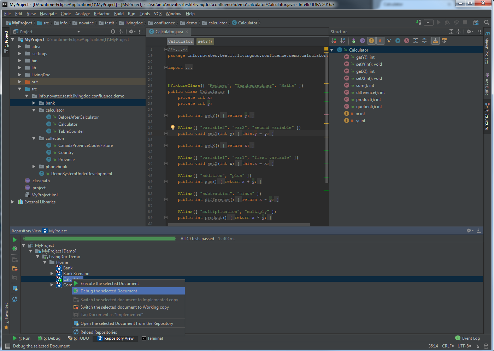

# LivingDoc Plugin for IntellIJ IDEA

LivingDoc is a powerful tool that supports implementing collaboration driven methods like Behavior Driven Development or Specification By Example. Due to its smart integration into Atlassian Confluence the comfortable editing possibilities of confluences can be used to write the feature specifications and the acceptance tests.

The LivingDoc Plugin for IntellIJ Idea makes it easier for developers to write, debug and execute automated acceptance tests in IntelliJ.

### Documentation
The [user documentation](https://testit-livingdoc.atlassian.net/wiki) provides in-depth documentation on all the features.
If you have further questions please get in touch with us.

### Contribute

Check the [Contributing](https://testit-livingdoc.atlassian.net/wiki/display/CURDOC/Contributing) documentation.

### Issues
If you experience any issues please use GitHub's [issue](https://github.com/testIT-LivingDoc/livingdoc-intellij/issues) system to tell us about it!

### Licensing
testIT LivingDoc is licensed under [GNU General Public License, Version 3.0](http://www.gnu.org/licenses/gpl-3.0.txt).

### Sponsoring
testIT LivingDoc is mainly developed by [NovaTec Solutions GmbH](http://www.novatec-gmbh.de/), a German consultancy firm that drives quality in software development projects.

